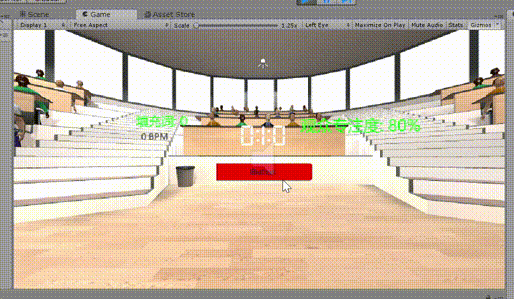
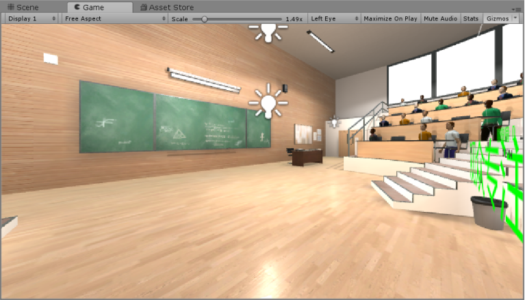
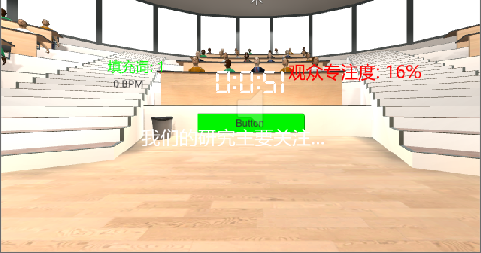
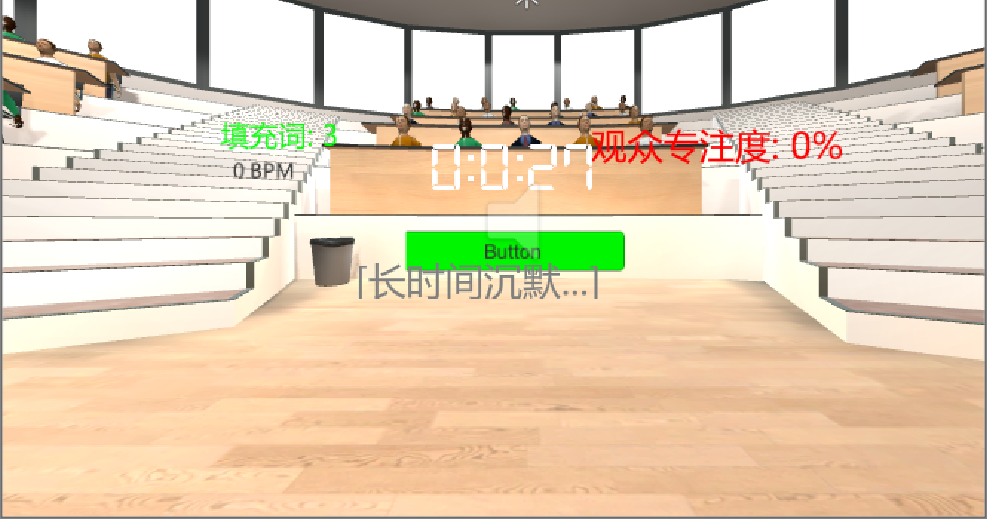
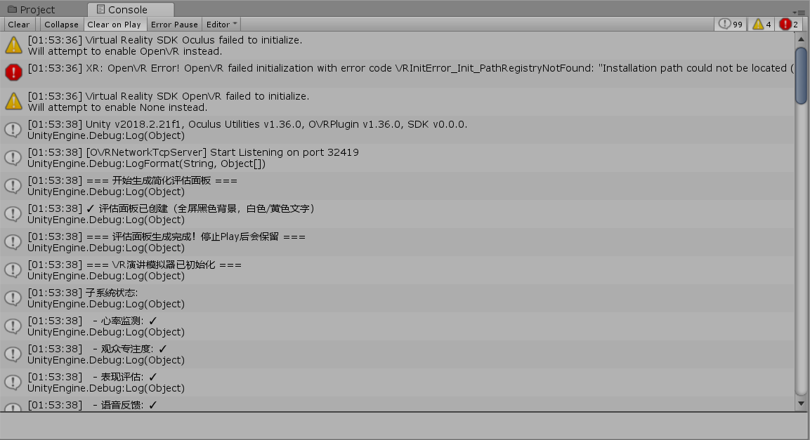
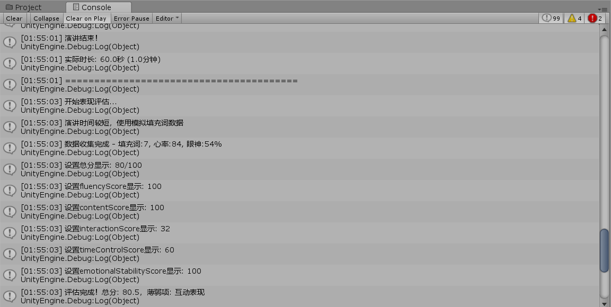

# 基于多模态反馈的自适应 VR 演讲训练系统

## 项目简介

本系统是基于Unity的VR演讲训练平台，通过模拟真实演讲环境和智能反馈机制，帮助用户克服公众演讲焦虑，提升演讲技能。

**核心特点**
- 沉浸式VR环境（支持Oculus等）
- 实时多模态反馈（观众、心率、语音）
- 五维度智能评估系统
- 演示模式（无VR设备也可使用）



## 已实现功能

### 1. 实时反馈系统

**观众专注度模拟**
- 根据演讲表现动态调整观众状态（认真/疲惫/分心）

**心率监测模拟**
- 模拟演讲时的心率变化（60-140 BPM）
- 心率过高时显示放松提示
- 压力事件触发心率波动

**语音反馈模拟**
- 检测填充词（"嗯"、"然后"、"那个"）
- 卡壳/结巴检测
- 长时间沉默检测
- 震动反馈提醒（视觉模拟）

### 2. 五维度评估系统

演讲结束后自动生成评估报告：

| 评估维度 | 评分依据 |
|---------|---------|
| 流畅度 | 填充词数量、卡壳次数 |
| 内容逻辑 | 偏离次数、连贯性 |
| 互动表现 | 观众专注度 |
| 时间控制 | 超时/不足时长 |
| 情绪稳定 | 平均心率、心率波动 |

## 技术实现

| 技术 | 说明 |
|------|------|
| Unity | 2018.2.21f1 |
| Oculus Integration | VR支持 |
| OpenVR SDK | 跨平台VR |
| C# |  |


**支持平台**: Oculus Rift/Quest、HTC Vive、Windows MR

## 系统架构

### 核心模块设计

```
PresentationManager（演讲管理主控制器）
    ├── AudienceAttentionManager（观众专注度反馈系统）
    ├── HeartRateMonitor（心率监测系统）
    ├── SpeechFeedbackSystem（语音反馈系统）
    └── PerformanceEvaluator（表现评估系统）
```

### 数据流

```
用户演讲 → 多模态检测（语音/行为/生理）
         ↓
    实时反馈显示（UI + 观众响应 + 提示）
         ↓
    数据收集（填充词/心率/专注度/时长）
         ↓
    五维度评分计算
         ↓
    评估报告生成 + 历史数据存储
```


## 快速开始

### 环境要求
- Unity 2018.2.21f1
- Windows 10/11
- （可选）VR头显

### 运行步骤

1. 克隆项目
```bash
git clone https://github.com/strangersinsist/VR-Public-Speaking-Trainer.git
```

2. 用Unity打开项目，打开场景 `Assets/University Classroom/Demo.unity`

3. 点击Play运行（连接VR设备自动切换到VR模式）

## 示例



控制台日志


